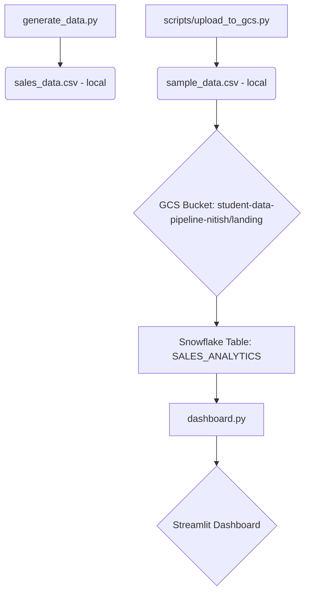

# Dataflow Diagram

This diagram illustrates the flow of data through the retail sales pipeline.

## Explanation

1.  **Data Generation**:
    *   `generate_data.py`: A script to generate a local CSV file named `sales_data.csv`.
    *   `scripts/upload_to_gcs.py`: This script creates a *different* local CSV file named `sample_data.csv`.

2.  **Data Upload**:
    *   The `upload_to_gcs.py` script uploads `sample_data.csv` to a Google Cloud Storage (GCS) bucket named `student-data-pipeline-nitish`, placing it in the `landing` folder.

3.  **Data Ingestion (GCS to Snowflake)**:
    *   An external process (not included in this repository, likely a Snowflake Snowpipe or a data loading job) ingests the data from the GCS bucket into a Snowflake table named `SALES_ANALYTICS`.

4.  **Data Visualization**:
    *   `dashboard.py`: A Streamlit application that connects to Snowflake, queries the `SALES_ANALYTICS` table, and displays the data in an interactive dashboard.
